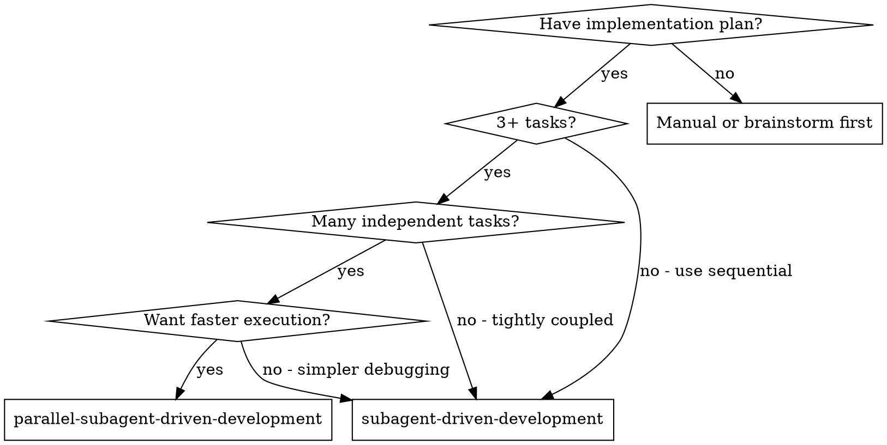
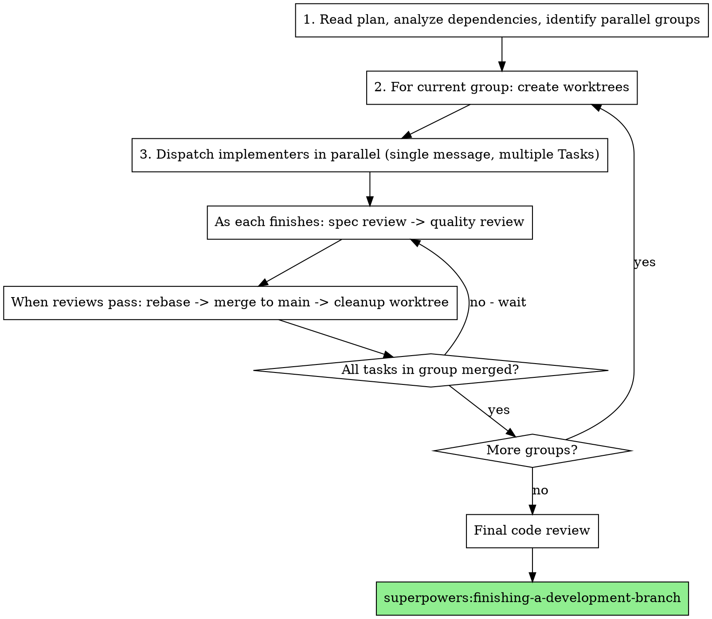

# Parallel Subagent-Driven Development Implementation Plan

> **For Claude:** REQUIRED SUB-SKILL: Use superpowers:executing-plans to implement this plan task-by-task.

**Goal:** Create a new skill that extends subagent-driven-development to run independent tasks concurrently in isolated git worktrees.

**Architecture:** Skill analyzes plan dependencies upfront to identify parallel groups, creates isolated worktrees per task, dispatches implementer subagents in parallel, runs two-stage review pipeline as tasks complete, and merges directly to main with conflict resolution.

**Tech Stack:** Markdown skill files, bash commands for git worktree management, Task tool for parallel subagent dispatch.

---

## Task 1: Create Skill Directory Structure

**Files:**
- Create: `skills/parallel-subagent-driven-development/SKILL.md`

**Step 1: Create directory**

```bash
mkdir -p skills/parallel-subagent-driven-development
```

**Step 2: Create SKILL.md with frontmatter and overview**

```markdown
---
name: parallel-subagent-driven-development
description: Use when executing implementation plans with many independent tasks - runs tasks concurrently in isolated worktrees
---

# Parallel Subagent-Driven Development

Execute plan by running independent tasks concurrently, each in its own git worktree. Maintains two-stage review process (spec compliance, then code quality) while parallelizing where possible.

**Core principle:** Dependency-aware scheduling + worktree isolation + per-task review pipeline = parallel execution without conflicts.

**Announce at start:** "I'm using parallel-subagent-driven-development to execute this plan with concurrent task execution."
```

**Step 3: Commit**

```bash
git add skills/parallel-subagent-driven-development/SKILL.md
git commit -m "feat: create parallel-subagent-driven-development skill directory"
```

---

## Task 2: Add When to Use Decision Flow

**Files:**
- Modify: `skills/parallel-subagent-driven-development/SKILL.md`

**Step 1: Add When to Use section with decision graph**

Append to SKILL.md after overview:

```markdown
## When to Use



**Use parallel-subagent-driven-development when:**
- Plan has 3+ tasks
- Many tasks are independent (can parallelize)
- Want faster execution
- Comfortable with direct-to-main merges

**Use regular subagent-driven-development when:**
- Tasks are tightly coupled (most depend on each other)
- Want simpler debugging (single timeline)
- Plan has mostly sequential dependencies
```

**Step 2: Commit**

```bash
git add skills/parallel-subagent-driven-development/SKILL.md
git commit -m "feat: add when-to-use decision flow"
```

---

## Task 3: Add Phase 1 - Plan Analysis

**Files:**
- Modify: `skills/parallel-subagent-driven-development/SKILL.md`

**Step 1: Add Phase 1 section**

Append to SKILL.md:

```markdown
## The Process

### Phase 1: Plan Analysis

Before dispatching any implementers, analyze the plan to identify what can run in parallel.

**Step 1.1: Extract all tasks**

Read the plan file and extract every task with:
- Task number and name
- Full task text
- Files it will create/modify

**Step 1.2: Analyze dependencies**

For each pair of tasks, check for:
- **Explicit dependencies:** "This task requires Task 2's API"
- **File conflicts:** Two tasks modify the same file
- **Inferred dependencies:** Task B uses a function Task A creates

**Step 1.3: Build dependency graph**

```
Example with 5 tasks:
- Task 1: Add user model (independent)
- Task 2: Add auth middleware (depends on Task 1)
- Task 3: Add logging utility (independent)
- Task 4: Add rate limiter (independent)
- Task 5: Add auth routes (depends on Task 1, Task 2)

Dependencies:
  Task 2 -> Task 1
  Task 5 -> Task 1, Task 2
```

**Step 1.4: Identify parallel groups**

Group tasks into waves that can run concurrently:

```
Parallel groups:
  Group A: [Task 1, Task 3, Task 4]  <- run in parallel
  Group B: [Task 2]                   <- after Task 1
  Group C: [Task 5]                   <- after Task 2
```

**Step 1.5: Create TodoWrite with groups**

Create TodoWrite showing all tasks with their group:

```
- [Group A] Task 1: Add user model
- [Group A] Task 3: Add logging utility
- [Group A] Task 4: Add rate limiter
- [Group B] Task 2: Add auth middleware
- [Group C] Task 5: Add auth routes
```
```

**Step 2: Commit**

```bash
git add skills/parallel-subagent-driven-development/SKILL.md
git commit -m "feat: add Phase 1 plan analysis"
```

---

## Task 4: Add Phase 2 - Worktree Setup and Dispatch

**Files:**
- Modify: `skills/parallel-subagent-driven-development/SKILL.md`

**Step 1: Add Phase 2 section**

Append to SKILL.md:

```markdown
### Phase 2: Worktree Setup & Dispatch

For each parallel group, set up isolated workspaces and dispatch implementers.

**Step 2.1: Create worktrees for group**

Create one worktree per task in the current group:

```bash
# Example for Group A
git worktree add .worktrees/task-1-user-model -b task-1-user-model
git worktree add .worktrees/task-3-logging -b task-3-logging
git worktree add .worktrees/task-4-rate-limiter -b task-4-rate-limiter
```

**Step 2.2: Verify worktree isolation**

If dependency analysis missed a file conflict (two tasks touch same file), fall back to sequential execution for those tasks.

**Step 2.3: Dispatch implementers in parallel**

Send a **single message with multiple Task tool calls** to run implementers concurrently:

```
Task("Implement Task 1: Add user model", work_dir=".worktrees/task-1-user-model")
Task("Implement Task 3: Add logging utility", work_dir=".worktrees/task-3-logging")
Task("Implement Task 4: Add rate limiter", work_dir=".worktrees/task-4-rate-limiter")
```

**CRITICAL:** All Task calls must be in the same message for true parallel execution.

Each implementer:
- Works in its isolated worktree
- Uses `./implementer-prompt.md` template
- Follows TDD, implements, tests, commits
- Self-reviews and reports back
```

**Step 2: Commit**

```bash
git add skills/parallel-subagent-driven-development/SKILL.md
git commit -m "feat: add Phase 2 worktree setup and dispatch"
```

---

## Task 5: Add Phase 3 - Per-Task Review Pipeline

**Files:**
- Modify: `skills/parallel-subagent-driven-development/SKILL.md`

**Step 1: Add Phase 3 section**

Append to SKILL.md:

```markdown
### Phase 3: Per-Task Review Pipeline

As implementers finish (in any order), immediately start that task's review pipeline.

**Step 3.1: Monitor for completion**

Watch for implementer subagents to return. Process completions as they arrive - don't wait for all.

**Step 3.2: Start spec review**

When an implementer finishes:

```
Task 3 finishes first:
  -> Dispatch spec reviewer for Task 3 (./spec-reviewer-prompt.md)
```

**Step 3.3: Spec review loop**

If spec reviewer finds issues:
1. Dispatch implementer to fix (same worktree)
2. Re-run spec review
3. Repeat until spec compliant

**Step 3.4: Start code quality review**

After spec passes:

```
  -> Spec passes
  -> Dispatch code quality reviewer for Task 3 (./code-quality-reviewer-prompt.md)
```

**Step 3.5: Code quality loop**

If code quality reviewer finds issues:
1. Dispatch implementer to fix (same worktree)
2. Re-run code quality review
3. Repeat until approved

**Step 3.6: Mark ready to merge**

When both reviews pass, task is ready for Phase 4.

**Parallelism in reviews:** Reviews for different tasks can run in parallel. Task 3's code quality review can happen while Task 1's spec review is running.

```
Timeline example:
  Task 3: [implement] [spec-review] [quality-review] [ready]
  Task 1: [implement.....] [spec-review] [fix] [spec-review] [quality-review] [ready]
  Task 4: [implement...........] [spec-review] [quality-review] [ready]
```
```

**Step 2: Commit**

```bash
git add skills/parallel-subagent-driven-development/SKILL.md
git commit -m "feat: add Phase 3 per-task review pipeline"
```

---

## Task 6: Add Phase 4 - Merge and Cleanup

**Files:**
- Modify: `skills/parallel-subagent-driven-development/SKILL.md`

**Step 1: Add Phase 4 section**

Append to SKILL.md:

```markdown
### Phase 4: Merge & Cleanup

When a task passes both reviews, merge it to main.

**Step 4.1: Rebase onto latest main**

```bash
cd .worktrees/task-3-logging
git fetch origin main
git rebase origin/main
```

**Step 4.2: Handle rebase success**

If rebase succeeds (no conflicts):

```bash
git checkout main
git merge task-3-logging --ff-only
git push origin main
git worktree remove .worktrees/task-3-logging
git branch -d task-3-logging
```

**Step 4.3: Handle rebase conflicts**

If rebase has conflicts:
1. Dispatch resolver subagent with conflict details (./resolver-prompt.md)
2. Resolver fixes conflicts, commits
3. Re-run code quality review (spec still valid)
4. Then merge as above

**Cleanup is immediate:** Worktree deleted right after successful merge. No lingering branches.

**Mark task complete:** Update TodoWrite to show task completed.
```

**Step 2: Commit**

```bash
git add skills/parallel-subagent-driven-development/SKILL.md
git commit -m "feat: add Phase 4 merge and cleanup"
```

---

## Task 7: Add Phase 5 - Next Parallel Group

**Files:**
- Modify: `skills/parallel-subagent-driven-development/SKILL.md`

**Step 1: Add Phase 5 section**

Append to SKILL.md:

```markdown
### Phase 5: Next Parallel Group

Once all tasks in a parallel group have merged, move to the next group.

**Step 5.1: Wait for group completion**

All tasks in current group must be merged to main before starting next group.

```
Group A complete (Tasks 1, 3, 4 merged to main)
  |
  v
Group B starts: Task 2 (depends on Task 1)
```

**Step 5.2: Create worktrees from latest main**

New worktrees branch from main, which now includes all previous group's work:

```bash
# Task 2 needs Task 1's code - now in main
git worktree add .worktrees/task-2-auth-middleware -b task-2-auth-middleware
```

**Step 5.3: Repeat Phases 2-4**

Dispatch implementers, review, merge - same as before.

**Step 5.4: Continue until all groups complete**

```
Group B complete (Task 2 merged)
  |
  v
Group C starts: Task 5 (depends on Tasks 1, 2 - both now in main)
  ...
```
```

**Step 2: Commit**

```bash
git add skills/parallel-subagent-driven-development/SKILL.md
git commit -m "feat: add Phase 5 next parallel group"
```

---

## Task 8: Add Phase 6 - Final Review

**Files:**
- Modify: `skills/parallel-subagent-driven-development/SKILL.md`

**Step 1: Add Phase 6 section**

Append to SKILL.md:

```markdown
### Phase 6: Final Review & Finish

After all groups complete:

**Step 6.1: Final code review**

Dispatch final code reviewer for entire implementation:
- Review all commits since plan started
- Verify cohesive integration
- Check for cross-task issues

**Step 6.2: Finish up**

Use `superpowers:finishing-a-development-branch` to complete.
```

**Step 2: Commit**

```bash
git add skills/parallel-subagent-driven-development/SKILL.md
git commit -m "feat: add Phase 6 final review"
```

---

## Task 9: Add Complete Flow Diagram

**Files:**
- Modify: `skills/parallel-subagent-driven-development/SKILL.md`

**Step 1: Add flow diagram section**

Append to SKILL.md:

```markdown
## Complete Flow Diagram


```

**Step 2: Commit**

```bash
git add skills/parallel-subagent-driven-development/SKILL.md
git commit -m "feat: add complete flow diagram"
```

---

## Task 10: Add Error Handling Section

**Files:**
- Modify: `skills/parallel-subagent-driven-development/SKILL.md`

**Step 1: Add error handling section**

Append to SKILL.md:

```markdown
## Error Handling

| Scenario | Action |
|----------|--------|
| Implementer fails | Dispatch fix subagent in same worktree |
| Spec review fails | Implementer fixes, re-review |
| Code quality review fails | Implementer fixes, re-review |
| Rebase conflicts | Dispatch resolver subagent, then re-run quality review |
| Unrecoverable error | Stop, report to user, preserve worktree for debugging |
| File conflict detected | Fall back to sequential for conflicting tasks |
```

**Step 2: Commit**

```bash
git add skills/parallel-subagent-driven-development/SKILL.md
git commit -m "feat: add error handling section"
```

---

## Task 11: Add Red Flags Section

**Files:**
- Modify: `skills/parallel-subagent-driven-development/SKILL.md`

**Step 1: Add red flags section**

Append to SKILL.md:

```markdown
## Red Flags

**Never:**
- Dispatch parallel implementers in separate messages (must be single message)
- Skip dependency analysis (causes merge conflicts)
- Start next group before current group fully merged
- Skip reviews (spec compliance OR code quality)
- Proceed with unfixed review issues
- Delete worktree before merge confirmed
- Force merge without rebase
- Skip conflict resolution re-review

**Always:**
- Analyze dependencies before dispatching
- Use single message for parallel Task calls
- Wait for group completion before next group
- Rebase before merge
- Re-run quality review after conflict resolution
- Clean up worktrees immediately after merge
```

**Step 2: Commit**

```bash
git add skills/parallel-subagent-driven-development/SKILL.md
git commit -m "feat: add red flags section"
```

---

## Task 12: Add Integration Section

**Files:**
- Modify: `skills/parallel-subagent-driven-development/SKILL.md`

**Step 1: Add integration section**

Append to SKILL.md:

```markdown
## Integration

**Required skills:**
- **superpowers:writing-plans** - Creates the plan this skill executes
- **superpowers:using-git-worktrees** - Worktree creation patterns
- **superpowers:requesting-code-review** - Review templates
- **superpowers:finishing-a-development-branch** - Completion workflow

**Subagents use:**
- **superpowers:test-driven-development** - Implementation approach

**Prompt templates:**
- `./implementer-prompt.md` - Implementer subagent (same as subagent-driven-development)
- `./spec-reviewer-prompt.md` - Spec compliance reviewer (same as subagent-driven-development)
- `./code-quality-reviewer-prompt.md` - Code quality reviewer (same as subagent-driven-development)
- `./resolver-prompt.md` - Conflict resolver subagent (new)

## Comparison with subagent-driven-development

| Aspect | subagent-driven-development | parallel-subagent-driven-development |
|--------|----------------------------|--------------------------------------|
| Execution | Sequential (one task at a time) | Parallel within groups |
| Isolation | Single working directory | One worktree per task |
| Review | After each task | After each task (in parallel) |
| Merge | Single branch | Direct to main per task |
| Speed | Slower | Faster for independent tasks |
| Debugging | Simpler (linear timeline) | More complex (concurrent timeline) |
```

**Step 2: Commit**

```bash
git add skills/parallel-subagent-driven-development/SKILL.md
git commit -m "feat: add integration section"
```

---

## Task 13: Create Resolver Prompt Template

**Files:**
- Create: `skills/parallel-subagent-driven-development/resolver-prompt.md`

**Step 1: Create resolver prompt file**

```markdown
# Resolver Subagent Prompt Template

Use this template when dispatching a resolver subagent to fix rebase conflicts.

**Purpose:** Resolve merge conflicts that occur when rebasing a task branch onto main.

```
Task tool (general-purpose):
  description: "Resolve conflicts for Task N"
  prompt: |
    You are resolving merge conflicts from rebasing a task branch onto main.

    ## Context

    Task N: [task name] was implemented and passed both reviews.
    During rebase onto latest main, conflicts occurred.

    ## Conflict Details

    [Output from git rebase showing conflicts]

    Files with conflicts:
    [List of conflicting files]

    ## Your Job

    1. Understand what the task implemented (from commit messages/diff)
    2. Understand what changed in main (the other side of conflict)
    3. Resolve conflicts preserving both:
       - The task's new functionality
       - Main's updates from other merged tasks
    4. Complete the rebase
    5. Run tests to verify resolution works

    ## Resolution Guidelines

    - Preserve the intent of both changes
    - If both added to same location, include both (in logical order)
    - If both modified same code, merge the logic correctly
    - Never silently drop either side's changes

    ## Report Format

    When done, report:
    - What conflicts you resolved
    - How you merged the changes
    - Test results after resolution
    - Any concerns about the resolution
```
```

**Step 2: Commit**

```bash
git add skills/parallel-subagent-driven-development/resolver-prompt.md
git commit -m "feat: add resolver prompt template"
```

---

## Task 14: Symlink Shared Prompt Templates

**Files:**
- Create: `skills/parallel-subagent-driven-development/implementer-prompt.md` (symlink)
- Create: `skills/parallel-subagent-driven-development/spec-reviewer-prompt.md` (symlink)
- Create: `skills/parallel-subagent-driven-development/code-quality-reviewer-prompt.md` (symlink)

**Step 1: Create symlinks to shared templates**

```bash
cd skills/parallel-subagent-driven-development
ln -s ../subagent-driven-development/implementer-prompt.md implementer-prompt.md
ln -s ../subagent-driven-development/spec-reviewer-prompt.md spec-reviewer-prompt.md
ln -s ../subagent-driven-development/code-quality-reviewer-prompt.md code-quality-reviewer-prompt.md
```

**Step 2: Commit**

```bash
git add skills/parallel-subagent-driven-development/implementer-prompt.md
git add skills/parallel-subagent-driven-development/spec-reviewer-prompt.md
git add skills/parallel-subagent-driven-development/code-quality-reviewer-prompt.md
git commit -m "feat: symlink shared prompt templates from subagent-driven-development"
```

---

## Task 15: Add Example Workflow

**Files:**
- Modify: `skills/parallel-subagent-driven-development/SKILL.md`

**Step 1: Add example workflow section**

Append to SKILL.md before Red Flags:

```markdown
## Example Workflow

```
You: I'm using parallel-subagent-driven-development to execute this plan.

[Phase 1: Analyze plan]
- Task 1: Add user model (creates: src/models/user.ts)
- Task 2: Add auth middleware (modifies: src/middleware/index.ts, uses Task 1)
- Task 3: Add logging utility (creates: src/utils/logger.ts)
- Task 4: Add rate limiter (creates: src/middleware/rateLimiter.ts)
- Task 5: Add auth routes (uses Task 1 & 2)

Dependency analysis:
- Task 2 depends on Task 1 (uses User model)
- Task 5 depends on Task 1 & 2

Parallel groups:
- Group A: [1, 3, 4] - all independent
- Group B: [2] - needs Task 1
- Group C: [5] - needs Task 2

[Phase 2: Group A]
Creating worktrees...
  git worktree add .worktrees/task-1-user-model -b task-1-user-model
  git worktree add .worktrees/task-3-logging -b task-3-logging
  git worktree add .worktrees/task-4-rate-limiter -b task-4-rate-limiter

Dispatching implementers in parallel (single message, 3 Task calls)...

[Task 3 completes first]
Spec review for Task 3... ✅ Compliant
Code quality review for Task 3... ✅ Approved
Rebasing Task 3... clean
Merging Task 3 to main... done
Cleaning up .worktrees/task-3-logging

[Task 1 completes]
Spec review for Task 1... ❌ Missing validation
Implementer fixing...
Spec review for Task 1... ✅ Compliant
Code quality review... ✅ Approved
Rebasing Task 1... clean
Merging Task 1 to main... done
Cleaning up .worktrees/task-1-user-model

[Task 4 completes]
Spec review for Task 4... ✅ Compliant
Code quality review... ✅ Approved
Rebasing Task 4... conflict in src/middleware/index.ts
Dispatching resolver...
Resolver: Merged both rate limiter and existing middleware exports
Quality re-review... ✅ Approved
Merging Task 4 to main... done
Cleaning up .worktrees/task-4-rate-limiter

Group A complete!

[Phase 2: Group B]
Creating worktree from latest main (includes Task 1's User model)...
  git worktree add .worktrees/task-2-auth-middleware -b task-2-auth-middleware

Dispatching implementer for Task 2...

[Task 2 completes]
Reviews pass, merge to main, cleanup.

Group B complete!

[Phase 2: Group C]
...similar...

[Phase 6]
Final code review... ✅ All integrated correctly
Using finishing-a-development-branch skill...

Done!
```
```

**Step 2: Commit**

```bash
git add skills/parallel-subagent-driven-development/SKILL.md
git commit -m "feat: add example workflow"
```

---

## Task 16: Update Version and Create PR

**Files:**
- Modify: `skills/parallel-subagent-driven-development/SKILL.md` (final review)

**Step 1: Read complete SKILL.md and verify**

Read the complete file to verify all sections are present and correctly formatted.

**Step 2: Run tests (if any)**

```bash
# Check for any skill tests
ls tests/
```

**Step 3: Final commit if any fixes needed**

```bash
git add -A
git commit -m "feat: finalize parallel-subagent-driven-development skill"
```

**Step 4: Push and create PR**

```bash
git push -u origin feat/parallel-dispatch
gh pr create --title "feat: add parallel-subagent-driven-development skill" --body "$(cat <<'EOF'
## Summary
- Adds new skill for parallel plan execution with worktree isolation
- Analyzes dependencies to identify parallel groups
- Dispatches concurrent implementers, runs reviews in parallel
- Merges directly to main with conflict resolution

## Test plan
- [ ] Verify SKILL.md renders correctly
- [ ] Test skill on a multi-task plan
- [ ] Verify symlinks work for prompt templates

Generated with [Claude Code](https://claude.com/claude-code)
EOF
)"
```

---

## Summary

| Task | Description | Files |
|------|-------------|-------|
| 1 | Create directory and base SKILL.md | skills/parallel-subagent-driven-development/SKILL.md |
| 2 | Add when-to-use decision flow | SKILL.md |
| 3 | Add Phase 1 - plan analysis | SKILL.md |
| 4 | Add Phase 2 - worktree setup and dispatch | SKILL.md |
| 5 | Add Phase 3 - per-task review pipeline | SKILL.md |
| 6 | Add Phase 4 - merge and cleanup | SKILL.md |
| 7 | Add Phase 5 - next parallel group | SKILL.md |
| 8 | Add Phase 6 - final review | SKILL.md |
| 9 | Add complete flow diagram | SKILL.md |
| 10 | Add error handling | SKILL.md |
| 11 | Add red flags | SKILL.md |
| 12 | Add integration section | SKILL.md |
| 13 | Create resolver prompt template | resolver-prompt.md |
| 14 | Symlink shared prompt templates | symlinks |
| 15 | Add example workflow | SKILL.md |
| 16 | Final review and PR | PR |
