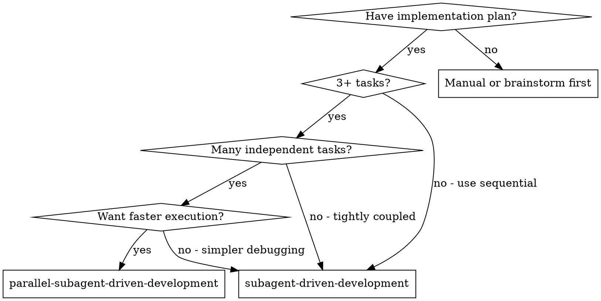
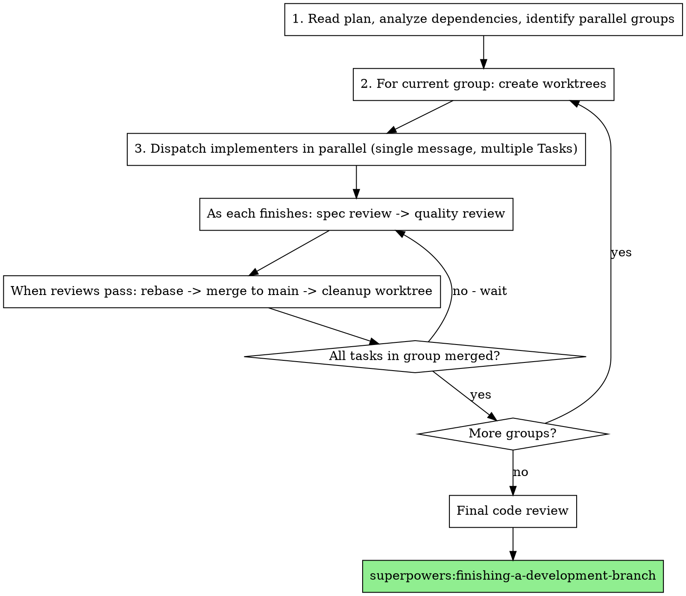

# Parallel Subagent-Driven Development

Execute plan by running independent tasks concurrently, each in its own git worktree. Maintains two-stage review process (spec compliance, then code quality) while parallelizing where possible.

**Core principle:** Dependency-aware scheduling + worktree isolation + per-task review pipeline = parallel execution without conflicts.

**Announce at start:** "I'm using parallel-subagent-driven-development to execute this plan with concurrent task execution."

## When to Use



**Use parallel-subagent-driven-development when:**
- Plan has 3+ tasks
- Many tasks are independent (can parallelize)
- Want faster execution
- Comfortable with direct-to-main merges

**Use regular subagent-driven-development when:**
- Tasks are tightly coupled (most depend on each other)
- Want simpler debugging (single timeline)
- Plan has mostly sequential dependencies

## The Process

### Phase 1: Plan Analysis

Before dispatching any implementers, analyze the plan to identify what can run in parallel.

**Step 1.1: Extract all tasks**

Read the plan file and extract every task with:
- Task number and name
- Full task text
- Files it will create/modify

**Step 1.2: Analyze dependencies**

For each pair of tasks, check for:
- **Explicit dependencies:** "This task requires Task 2's API"
- **File conflicts:** Two tasks modify the same file
- **Inferred dependencies:** Task B uses a function Task A creates

**Step 1.3: Build dependency graph**

```
Example with 5 tasks:
- Task 1: Add user model (independent)
- Task 2: Add auth middleware (depends on Task 1)
- Task 3: Add logging utility (independent)
- Task 4: Add rate limiter (independent)
- Task 5: Add auth routes (depends on Task 1, Task 2)

Dependencies:
  Task 2 -> Task 1
  Task 5 -> Task 1, Task 2
```

**Step 1.4: Identify parallel groups**

Group tasks into waves that can run concurrently:

```
Parallel groups:
  Group A: [Task 1, Task 3, Task 4]  <- run in parallel
  Group B: [Task 2]                   <- after Task 1
  Group C: [Task 5]                   <- after Task 2
```

**Step 1.5: Create TodoWrite with groups**

Create TodoWrite showing all tasks with their group:

```
- [Group A] Task 1: Add user model
- [Group A] Task 3: Add logging utility
- [Group A] Task 4: Add rate limiter
- [Group B] Task 2: Add auth middleware
- [Group C] Task 5: Add auth routes
```

### Phase 2: Worktree Setup & Dispatch

For each parallel group, set up isolated workspaces and dispatch implementers.

**Step 2.1: Create worktrees for group**

Create one worktree per task in the current group:

```bash
# Example for Group A
git worktree add .worktrees/task-1-user-model -b task-1-user-model
git worktree add .worktrees/task-3-logging -b task-3-logging
git worktree add .worktrees/task-4-rate-limiter -b task-4-rate-limiter
```

**Step 2.2: Verify worktree isolation**

If dependency analysis missed a file conflict (two tasks touch same file), fall back to sequential execution for those tasks.

**Step 2.3: Dispatch implementers in parallel**

Send a **single message with multiple Task tool calls** to run implementers concurrently:

```
Task("Implement Task 1: Add user model", work_dir=".worktrees/task-1-user-model")
Task("Implement Task 3: Add logging utility", work_dir=".worktrees/task-3-logging")
Task("Implement Task 4: Add rate limiter", work_dir=".worktrees/task-4-rate-limiter")
```

**CRITICAL:** All Task calls must be in the same message for true parallel execution.

Each implementer:
- Works in its isolated worktree
- Uses `./implementer-prompt.md` template
- Follows TDD, implements, tests, commits
- Self-reviews and reports back

### Phase 3: Per-Task Review Pipeline

As implementers finish (in any order), immediately start that task's review pipeline.

**Step 3.1: Monitor for completion**

Watch for implementer subagents to return. Process completions as they arrive - don't wait for all.

**Step 3.2: Start spec review**

When an implementer finishes:

```
Task 3 finishes first:
  -> Dispatch spec reviewer for Task 3 (./spec-reviewer-prompt.md)
```

**Step 3.3: Spec review loop**

If spec reviewer finds issues:
1. Dispatch implementer to fix (same worktree)
2. Re-run spec review
3. Repeat until spec compliant

**Step 3.4: Start code quality review**

After spec passes:

```
  -> Spec passes
  -> Dispatch code quality reviewer for Task 3 (./code-quality-reviewer-prompt.md)
```

**Step 3.5: Code quality loop**

If code quality reviewer finds issues:
1. Dispatch implementer to fix (same worktree)
2. Re-run code quality review
3. Repeat until approved

**Step 3.6: Mark ready to merge**

When both reviews pass, task is ready for Phase 4.

**Parallelism in reviews:** Reviews for different tasks can run in parallel. Task 3's code quality review can happen while Task 1's spec review is running.

```
Timeline example:
  Task 3: [implement] [spec-review] [quality-review] [ready]
  Task 1: [implement.....] [spec-review] [fix] [spec-review] [quality-review] [ready]
  Task 4: [implement...........] [spec-review] [quality-review] [ready]
```

### Phase 4: Merge & Cleanup

When a task passes both reviews, merge it to main.

**Step 4.1: Rebase onto latest main**

```bash
cd .worktrees/task-3-logging
git fetch origin main
git rebase origin/main
```

**Step 4.2: Handle rebase success**

If rebase succeeds (no conflicts):

```bash
git checkout main
git merge task-3-logging --ff-only
git push origin main
git worktree remove .worktrees/task-3-logging
git branch -d task-3-logging
```

**Step 4.3: Handle rebase conflicts**

If rebase has conflicts:
1. Dispatch resolver subagent with conflict details (./resolver-prompt.md)
2. Resolver fixes conflicts, commits
3. Re-run code quality review (spec still valid)
4. Then merge as above

**Cleanup is immediate:** Worktree deleted right after successful merge. No lingering branches.

**Mark task complete:** Update TodoWrite to show task completed.

### Phase 5: Next Parallel Group

Once all tasks in a parallel group have merged, move to the next group.

**Step 5.1: Wait for group completion**

All tasks in current group must be merged to main before starting next group.

```
Group A complete (Tasks 1, 3, 4 merged to main)
  |
  v
Group B starts: Task 2 (depends on Task 1)
```

**Step 5.2: Create worktrees from latest main**

New worktrees branch from main, which now includes all previous group's work:

```bash
# Task 2 needs Task 1's code - now in main
git worktree add .worktrees/task-2-auth-middleware -b task-2-auth-middleware
```

**Step 5.3: Repeat Phases 2-4**

Dispatch implementers, review, merge - same as before.

**Step 5.4: Continue until all groups complete**

```
Group B complete (Task 2 merged)
  |
  v
Group C starts: Task 5 (depends on Tasks 1, 2 - both now in main)
  ...
```

### Phase 6: Final Review & Finish

After all groups complete:

**Step 6.1: Final code review**

Dispatch final code reviewer for entire implementation:
- Review all commits since plan started
- Verify cohesive integration
- Check for cross-task issues

**Step 6.2: Finish up**

Use `superpowers:finishing-a-development-branch` to complete.

## Complete Flow Diagram



## Error Handling

| Scenario | Action |
|----------|--------|
| Implementer fails | Dispatch fix subagent in same worktree |
| Spec review fails | Implementer fixes, re-review |
| Code quality review fails | Implementer fixes, re-review |
| Rebase conflicts | Dispatch resolver subagent, then re-run quality review |
| Unrecoverable error | Stop, report to user, preserve worktree for debugging |
| File conflict detected | Fall back to sequential for conflicting tasks |

## Red Flags

**Never:**
- Dispatch parallel implementers in separate messages (must be single message)
- Skip dependency analysis (causes merge conflicts)
- Start next group before current group fully merged
- Skip reviews (spec compliance OR code quality)
- Proceed with unfixed review issues
- Delete worktree before merge confirmed
- Force merge without rebase
- Skip conflict resolution re-review

**Always:**
- Analyze dependencies before dispatching
- Use single message for parallel Task calls
- Wait for group completion before next group
- Rebase before merge
- Re-run quality review after conflict resolution
- Clean up worktrees immediately after merge
