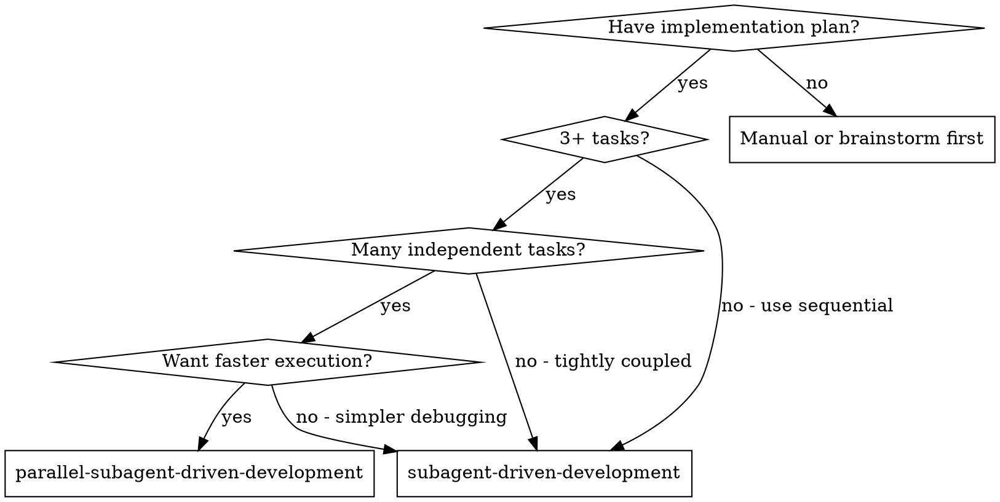

# Parallel Subagent-Driven Development

Execute plan by running independent tasks concurrently, each in its own git worktree. Maintains two-stage review process (spec compliance, then code quality) while parallelizing where possible.

**Core principle:** Dependency-aware scheduling + worktree isolation + per-task review pipeline = parallel execution without conflicts.

**Announce at start:** "I'm using parallel-subagent-driven-development to execute this plan with concurrent task execution."

## When to Use

**Use parallel-subagent-driven-development when:**
- Plan has 3+ tasks
- Many tasks are independent (can parallelize)
- Want faster execution
- Comfortable with direct-to-main merges

**Use regular subagent-driven-development when:**
- Tasks are tightly coupled (most depend on each other)
- Want simpler debugging (single timeline)
- Plan has mostly sequential dependencies
