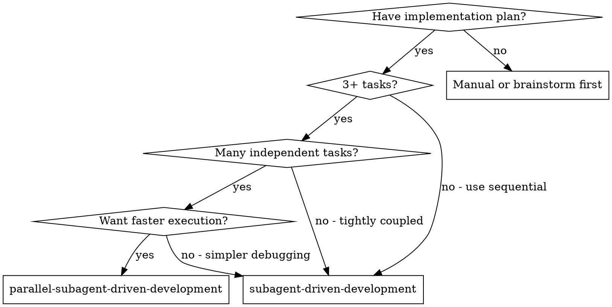

# Parallel Subagent-Driven Development

Execute plan by running independent tasks concurrently, each in its own git worktree. Maintains two-stage review process (spec compliance, then code quality) while parallelizing where possible.

**Core principle:** Dependency-aware scheduling + worktree isolation + per-task review pipeline = parallel execution without conflicts.

**Announce at start:** "I'm using parallel-subagent-driven-development to execute this plan with concurrent task execution."

## When to Use



**Use parallel-subagent-driven-development when:**
- Plan has 3+ tasks
- Many tasks are independent (can parallelize)
- Want faster execution
- Comfortable with direct-to-main merges

**Use regular subagent-driven-development when:**
- Tasks are tightly coupled (most depend on each other)
- Want simpler debugging (single timeline)
- Plan has mostly sequential dependencies

## The Process

### Phase 1: Plan Analysis

Before dispatching any implementers, analyze the plan to identify what can run in parallel.

**Step 1.1: Extract all tasks**

Read the plan file and extract every task with:
- Task number and name
- Full task text
- Files it will create/modify

**Step 1.2: Analyze dependencies**

For each pair of tasks, check for:
- **Explicit dependencies:** "This task requires Task 2's API"
- **File conflicts:** Two tasks modify the same file
- **Inferred dependencies:** Task B uses a function Task A creates

**Step 1.3: Build dependency graph**

```
Example with 5 tasks:
- Task 1: Add user model (independent)
- Task 2: Add auth middleware (depends on Task 1)
- Task 3: Add logging utility (independent)
- Task 4: Add rate limiter (independent)
- Task 5: Add auth routes (depends on Task 1, Task 2)

Dependencies:
  Task 2 -> Task 1
  Task 5 -> Task 1, Task 2
```

**Step 1.4: Identify parallel groups**

Group tasks into waves that can run concurrently:

```
Parallel groups:
  Group A: [Task 1, Task 3, Task 4]  <- run in parallel
  Group B: [Task 2]                   <- after Task 1
  Group C: [Task 5]                   <- after Task 2
```

**Step 1.5: Create TodoWrite with groups**

Create TodoWrite showing all tasks with their group:

```
- [Group A] Task 1: Add user model
- [Group A] Task 3: Add logging utility
- [Group A] Task 4: Add rate limiter
- [Group B] Task 2: Add auth middleware
- [Group C] Task 5: Add auth routes
```

### Phase 2: Worktree Setup & Dispatch

For each parallel group, set up isolated workspaces and dispatch implementers.

**Step 2.1: Create worktrees for group**

Create one worktree per task in the current group:

```bash
# Example for Group A
git worktree add .worktrees/task-1-user-model -b task-1-user-model
git worktree add .worktrees/task-3-logging -b task-3-logging
git worktree add .worktrees/task-4-rate-limiter -b task-4-rate-limiter
```

**Step 2.2: Verify worktree isolation**

If dependency analysis missed a file conflict (two tasks touch same file), fall back to sequential execution for those tasks.

**Step 2.3: Dispatch implementers in parallel**

Send a **single message with multiple Task tool calls** to run implementers concurrently:

```
Task("Implement Task 1: Add user model", work_dir=".worktrees/task-1-user-model")
Task("Implement Task 3: Add logging utility", work_dir=".worktrees/task-3-logging")
Task("Implement Task 4: Add rate limiter", work_dir=".worktrees/task-4-rate-limiter")
```

**CRITICAL:** All Task calls must be in the same message for true parallel execution.

Each implementer:
- Works in its isolated worktree
- Uses `./implementer-prompt.md` template
- Follows TDD, implements, tests, commits
- Self-reviews and reports back
